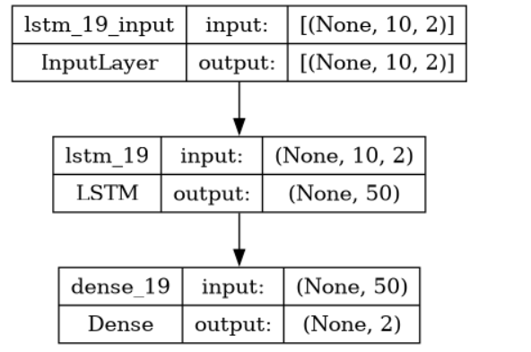
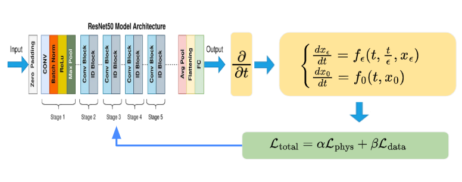
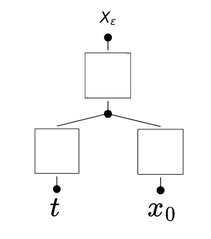

# PFE-DeepLearning-SurrogateModels
A part of the final year project solution for low cost,sprase and explainable situations using LSTM,PINN,KAN-based surrogate models for two scale dynamics forecasting.
## Two scale dynamical systems
Two-scale dynamical systems involve processes that operate on two distinct time or spatial scales, typically a fast scale and a slow scale. the dynamics of the slow scale are sually described as the macroscopic dynamics $x_0(t)$ which can be extracted using homogenization theory or approximated using a  rolling average while the fast scale dynamics typically titled macroscopic dynamics $x_\epsilon(t,\frac{t}{\epsilon})$ with $\epsilon$ being the ratio of heterogenity. The macrosocpic dynamics represent the average of the dynamics as $\epsilon \to 0$.

To test the validity of the surrogates two dynamical systems from the PFE were chosen:

$$
\text{Model 1:}\begin{cases}
\frac{dx_\epsilon}{dt}=f_\epsilon(t,\frac{t}{\epsilon},x_\epsilon)=-x_\epsilon cos(2\pi\frac{t}{\epsilon})\\
\frac{dx_0}{dt}=f_0(t,x_0)\implies x_0(t)=2.5\\
\end{cases}
$$

$$
\text{Model 5:}\begin{cases}
\frac{dx_\epsilon}{dt}=-x_\epsilon cos((2\pi+\epsilon cos(10t))(\frac{t}{\epsilon}))\\
x_0(t)=?\\
\end{cases}
$$

For model 1 we can rely on the hoogenization to extract the macroscopic behavior while for model 5 we rely on the rolling average.
## LSTM-Surrogate :
For sufficiently large and informative training data a basic LSTM network is used as a mapping $\mathcal{F}:t\to [x_0(t),x_\epsilon(t)]^T$, the architecture is described bellow: 

  

## PINN-Surrogate :
For sparse training data a ResNet based PINN network is used as a mapping $\mathcal{F}:t\to [x_0(t),x_\epsilon(t)]^T$ with a specialized hubert loss. This nis only tested on model 1 since its dynamics on both scales are well known. The architecture is described bellow: 

  

## KAN-Surrogate :
For explainability a simple KAN network is used as a mapping $\mathcal{F}:[t,x_0(t)]^T \to x_\epsilon(t)$ . The architecture is described bellow: 

  

